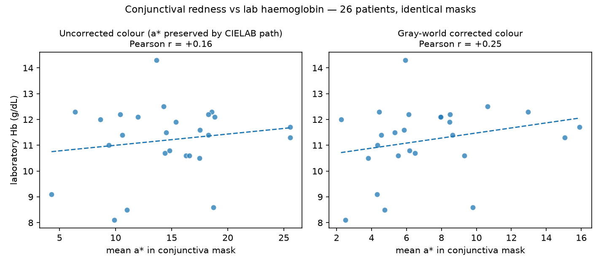

# CIELAB Normalization vs Gray-World White Balance

Which lighting-normalization strategy serves this project better? Both exist in
the codebase — gray-world white balance in `src/anemia/imaging.py`, and
CIELAB + CLAHE-on-L\* in `cielab_pipeline.py` — and they are often framed as
alternatives. This document compares them technically and measures both against
the local cohort's laboratory Hb values.

**Verdict up front: they solve different problems and are complementary, not
competing.** On the evidence below, the strongest configuration combines them:
gray-world to correct illuminant *colour*, then CIELAB a\*/b\* channels to
discard illuminant *brightness*. The final call should still be an ablation at
training time.

---

## 1. What each method actually does

### Gray-world white balance
Assumes the scene, averaged over all pixels, should be grey. Computes each RGB
channel's mean and rescales the channels until those means agree.

- **Corrects:** illuminant *colour* — the yellow cast of tungsten light, the
  green of fluorescent tubes, per-device ISP differences. After correction,
  "red" means approximately the same thing across captures.
- **Distorts:** colour on scenes that are not grey on average. An eye close-up
  is mostly skin, so the correction is pulled by frame composition — how much
  skin vs sclera happens to be in frame — which perturbs the very redness being
  measured, differently per capture.

### CIELAB + CLAHE on L\*
Converts to CIELAB, which separates lightness (L\*) from colour (a\* = green–red,
b\* = blue–yellow). Applies contrast-limited adaptive histogram equalization to
L\* only. In `cielab_pipeline.py` the regressor then receives only a\*/b\*.

- **Corrects:** illuminant *brightness and contrast* — exposure differences,
  shadows, vignetting — without touching colour at all.
- **Does not correct:** illuminant colour. A warm bulb genuinely shifts a\*/b\*;
  nothing in this method removes that shift, and a\*/b\* are exactly what the
  regressor consumes.

### The key structural fact
**CLAHE on L\* leaves a\*/b\* mathematically unchanged.** So for the colour
values the regressor sees, "CIELAB normalization" is identical to *no colour
normalization*. The real comparison is therefore:

> gray-world-corrected colour  **vs**  uncorrected colour.

---

## 2. Measured on the local cohort

26 patients, both eyes photographed, laboratory Hb for each. Design:

- One conjunctiva mask per image (refined extractor, standard pipeline input),
  **identical for both variants** — this isolates colour measurement from
  segmentation.
- Summary statistic: mean a\* inside the mask (a\* is the green–red axis; it is
  the dominant haemoglobin correlate in the literature and the core of the
  CIELAB pipeline's own design).
- Two tests: (a) correlation of per-patient mean a\* with lab Hb;
  (b) within-patient consistency — the same child's two eyes have the same
  true Hb, so the a\* gap between left and right eye is pure measurement noise.

| | Uncorrected colour (CIELAB path) | Gray-world corrected |
|---|---|---|
| Pearson r with lab Hb | +0.16 | **+0.25** |
| Spearman ρ with lab Hb | +0.02 | **+0.30** |
| Left–right eye a\* gap (median) | 2.69 | **2.02** |
| Left–right eye a\* gap (mean) | 3.02 | **2.26** |



**Reading the result.** Without colour correction, per-shot illuminant
differences add noise that almost completely destroys the monotonic
redness–Hb relationship (ρ ≈ 0). Gray-world removes part of that per-shot cast:
the same patient's two eyes agree ~25% better, and redness recovers a modest
but real correlation with Hb. On this cohort, colour-cast noise demonstrably
outweighs gray-world's composition distortion.

**Caveats, stated plainly.**
- n = 26. Correlations this size have wide confidence intervals; the *ranking*
  of the two methods is the reliable finding, not the exact r values.
- Mean-a\* is a deliberately crude summary. A CNN sees spatial patterns a mean
  cannot; absolute correlations will differ at training time.
- All captures appear to come from one device/setting. Cross-device colour
  differences — where gray-world should help most and uncorrected colour
  suffer most — are not tested here. This likely *understates* gray-world's
  advantage for the deployed app.

---

## 3. Advantages and disadvantages

| | Gray-world white balance | CIELAB (CLAHE-L\*, a\*/b\* regression) |
|---|---|---|
| Illuminant colour cast | **Corrected** | Uncorrected — leaks into a\*/b\* |
| Illuminant brightness | Untouched | **Corrected (CLAHE) / discarded (drop L\*)** |
| Preserves captured colour exactly | No — composition-dependent shift | **Yes** |
| Cross-device robustness | **Better** (casts equalized) | Weaker for colour, stronger for exposure |
| Signal retained | Full RGB (incl. lightness pallor cue) | Colour only — pale-is-lighter cue in L\* is discarded |
| Failure mode | Non-grey scenes skew correction | Warm/cool lighting read as physiology |
| Measured here (Hb corr. / eye consistency) | **+0.25 / 2.02** | +0.16 / 2.69 |

The a\*/b\*-only regression idea has a real strength the table understates:
discarding L\* makes the network provably blind to brightness, an invariance
gray-world cannot offer. Its weakness is inheriting uncorrected colour casts.

## 4. Recommendation

The two methods correct **orthogonal axes** of the same problem (colour vs
brightness), so the natural configuration is both in sequence:

```
capture → gray-world (fix colour cast) → CIELAB → keep a*/b* (discard brightness)
```

Proposed experiment arms for regressor training, same splits and masks:

1. Gray-world → RGB input (current default)
2. Uncorrected → a\*/b\* input (CIELAB pipeline as designed)
3. **Gray-world → a\*/b\* input (hybrid)** — tested at channel-mean scale in
   `../05_representation_ablation/`; it did not win there, so it stays an arm
   to test with a CNN rather than the presumed favourite
4. Long-term: a physical colour-reference card in frame replaces both
   assumptions with measurement — worth pursuing for the hospital protocol.

A first ablation at channel-mean scale (`../05_representation_ablation/`)
found **no arm beating the predict-the-mean baseline**, with gray-world RGB
marginally ahead. The ranking between corrected and uncorrected colour held in
both pairs. The CNN ablation still decides.

## 5. Reproducing these numbers

Masks from `refined_conjunctiva_mask` computed once per image on the standard
pipeline input; mean a\* measured inside the same mask on the raw and the
gray-world image; per-patient values average both eyes; Spearman on ranks,
Pearson on values; consistency = |left a\* − right a\*| per patient. Cohort
loading via `anemia.data.load_local_cohort`. Figure:
`colour_normalisation_vs_hb.png`.
