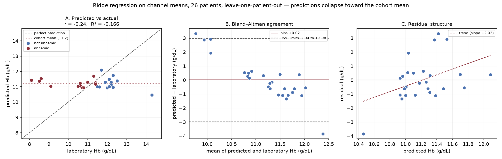

# How the Haemoglobin Value Is Produced, and How It Is Scored

Two parts: the exact mechanism that turns a photograph into a g/dL number, and
the full metric suite computed on everything currently available.

Reproduce with `python experiments/06_metrics_evaluation/evaluate.py`.
Raw output: `metrics.json`.

---

# Part 1 — Where the Hb number comes from

## 1.1 There is no haemoglobin library

No library, in Python or elsewhere, converts an eye photograph into a
haemoglobin value. Nothing is imported that knows anything about blood.

What *is* imported is general-purpose machinery:

| Library | What it actually provides | What it does **not** provide |
|---|---|---|
| `torchvision` | The ResNet-18 *architecture*, and weights pretrained on ImageNet (1.28M photographs of animals, vehicles, household objects) | Any notion of haemoglobin, blood, or eyes |
| `transformers` | The Mask2Former segmentation architecture and generic pretrained weights | Any notion of conjunctiva |
| `opencv` | Colour-space conversion, thresholding, morphology, grabCut | Any medical interpretation |
| `torch` | Tensors, autograd, optimisers | — |

The mapping from image to haemoglobin does not exist until **we create it** by
training on paired examples (photograph, laboratory Hb). That mapping is the
entire scientific contribution of the project; everything else is plumbing.

## 1.2 The actual mechanism, end to end

**Step 1 — the image becomes a tensor.** After extraction the conjunctiva crop
is a 224×224×3 array of integers 0–255. It is transposed to (3, 224, 224),
divided by 255, then ImageNet-normalised channel-wise:

```
x = (pixel/255 − mean) / std        mean = (0.485, 0.456, 0.406)
                                    std  = (0.229, 0.224, 0.225)
```

Those constants are the channel statistics of ImageNet. They are used because
the pretrained weights were fitted on data with that distribution; feeding a
different distribution degrades the transferred features.

**Step 2 — the network produces one number.** ResNet-18 is 18 weight layers of
convolution and residual addition. Its final classification layer (1000
ImageNet categories) is **removed and replaced** by:

```
Dropout(p = 0.3) → Linear(512 → 1)
```

so the network emits a single scalar per image. Layers up to `layer3` are
frozen at their ImageNet values; `layer4` and the new head are trained.

**Step 3 — the scalar is not haemoglobin yet.** During training the targets are
standardised, because a network optimises more stably around zero:

```
y_standardised = (Hb − train_mean) / train_std
```

so the network learns to output a standardised value. Converting back:

```
Hb (g/dL) = network_output × train_std + train_mean
```

For the current phantom checkpoint `train_mean = 12.3560`, `train_std =
2.4091`. **Both constants are stored inside the checkpoint file.** Without
them the network's output is a dimensionless number with no way back to g/dL —
which is why the checkpoint format carries them alongside the weights.

**Step 4 — the screening decision.** The continuous estimate is compared with
the WHO threshold for that patient's age and sex (11.0 / 11.5 / 12.0 / 13.0
g/dL). Nothing is learned here; it is a lookup and a comparison.

## 1.3 What "training" actually adjusts

Roughly 11.2 million parameters exist in ResNet-18. With `layer3` and earlier
frozen, about **8.4 million** remain trainable (`layer4` plus the head). Each
training step:

1. runs a batch forward to get predicted standardised Hb,
2. computes smooth-L1 loss against the true standardised Hb, weighted so rare
   severe-anaemia cases count more,
3. back-propagates to get a gradient per trainable parameter,
4. lets AdamW nudge every parameter down its gradient.

Repeated over epochs, this is the *only* process by which redness becomes
haemoglobin. Nothing else in the codebase encodes that relationship.

---

# Part 2 — The metrics

## 2.1 Regression metrics (continuous Hb)

With `e = predicted − true` over `n` patients:

| Metric | Formula | Units | What it tells you |
|---|---|---|---|
| **MSE** | `mean(e²)` | (g/dL)² | Squared-error average. Punishes large errors quadratically — good as a training loss, awkward to read because the units are squared. |
| **RMSE** | `√MSE` | g/dL | Back in readable units, still dominated by the worst cases. |
| **MAE** | `mean(|e|)` | g/dL | "Typically wrong by this much." The number to quote to a clinician. |
| **Median AE** | `median(|e|)` | g/dL | Same idea, immune to one catastrophic case. If it is far below MAE, a few outliers dominate. |
| **Bias** | `mean(e)` | g/dL | Systematic offset. **Positive bias means over-estimating Hb, i.e. systematically declaring anaemic patients healthy** — the dangerous direction. |
| **R²** | `1 − Σe² / Σ(true − mean)²` | — | Fraction of variance explained. 0 = no better than always predicting the mean. **Negative = worse than that.** |
| **Pearson r** | `corr(pred, true)` | — | Linear agreement. Negative means predictions move opposite to truth. |
| **Limits of agreement** | `bias ± 1.96·SD(e)` | g/dL | Bland–Altman interval containing ~95% of errors. The standard clinical device-vs-lab comparison. |

## 2.2 Classification metrics (anaemic / not)

Positive class = **anaemic**, because that is the case a screening tool exists
to catch. From the confusion matrix (TP, FP, TN, FN):

| Metric | Formula | What it tells you |
|---|---|---|
| **Accuracy** | `(TP+TN)/n` | Overall correctness. **Misleading under class imbalance** — at 90% prevalence, always saying "anaemic" scores 0.90. |
| **Precision (PPV)** | `TP/(TP+FP)` | Of those we flagged, how many really were anaemic. Low precision = wasted confirmatory blood tests. |
| **Recall (sensitivity)** | `TP/(TP+FN)` | Of all truly anaemic patients, how many we caught. **The metric that matters most here** — a false negative sends an unwell patient home untreated. |
| **Specificity** | `TN/(TN+FP)` | Of the healthy, how many we correctly cleared. |
| **NPV** | `TN/(TN+FN)` | When we say "normal", how often that is true. |
| **F1** | `2·P·R/(P+R)` | Harmonic mean of precision and recall. Harmonic, not arithmetic, so a model cannot score well by sacrificing one for the other. |
| **Balanced accuracy** | `(sensitivity + specificity)/2` | Accuracy corrected for class imbalance. |

---

# Part 3 — Results

## 3.1 Evaluation A — synthetic phantoms

ResNet-18 checkpoint, 3-fold patient-grouped CV, out-of-fold predictions,
n = 74 images.

> **Not a clinical result.** The phantoms are flat-coloured shapes whose
> redness is a deterministic linear function of Hb. The task is trivially
> learnable by construction. This evaluation exists to verify the metric code
> and to show what the pipeline reports when a model genuinely fits.

| Regression | Model | Mean baseline |
|---|---|---|
| MSE ((g/dL)²) | **0.698** | 6.244 |
| RMSE (g/dL) | **0.836** | 2.499 |
| MAE (g/dL) | **0.666** | 2.119 |
| Median AE (g/dL) | 0.524 | 1.953 |
| Bias (g/dL) | +0.038 | 0.000 |
| R² | **0.888** | 0.000 |
| Max abs error (g/dL) | 2.310 | 5.703 |
| Pearson r | 0.943 | — |
| Limits of agreement | −1.61 to +1.69 | −4.93 to +4.93 |

| Screening (prevalence 0.49) | Model | Majority baseline |
|---|---|---|
| Confusion | TP 36, FN 0, FP 1, TN 37 | — |
| Accuracy | **0.986** | 0.514 |
| Balanced accuracy | 0.987 | 0.500 |
| Precision (PPV) | 0.973 | — |
| Recall (sensitivity) | **1.000** | 0.000 |
| Specificity | 0.974 | 1.000 |
| NPV | 1.000 | 0.514 |
| F1 | **0.986** | 0.000 |

Interpretation: the pipeline is capable of learning and reporting a strong
result when the signal is present. MAE beats the baseline by 1.45 g/dL and
recall is perfect. On phantoms, this is expected rather than impressive.

## 3.2 Evaluation B — real cohort

> **Superseded numbers.** The figures below use channel means and leave-one-out.
> The current best configuration is the erythema index, and the deployed model
> is fitted on all 26 patients: **pipeline A reaches MAE 0.944, R² 0.133,
> F1 0.727, accuracy 0.654** against a full-sample-mean baseline of MAE 1.041,
> R² 0.000; held out it gives MAE 1.062, R² −0.094. See
> `../11_head_to_head/RESULTS.md` for the full two-pipeline comparison in both
> framings.


26 patients, laboratory Hb, ridge regression over channel means,
leave-one-patient-out. No CNN has been trained on real data.

| Regression | Model | Mean baseline | Verdict |
|---|---|---|---|
| MSE ((g/dL)²) | 2.188 | **2.030** | worse |
| RMSE (g/dL) | 1.479 | **1.425** | worse |
| MAE (g/dL) | **1.073** | 1.083 | tied |
| Median AE (g/dL) | **0.614** | 0.780 | slightly better |
| Bias (g/dL) | +0.020 | 0.000 | negligible |
| R² | **−0.166** | −0.082 | worse than the mean |
| Max abs error (g/dL) | 3.839 | 3.228 | worse |
| Pearson r | **−0.238** | — | anti-correlated |
| Limits of agreement | −2.94 to +2.98 | −2.85 to +2.85 | equivalent |

| Screening (prevalence 0.50) | Model | Baseline | Verdict |
|---|---|---|---|
| Confusion | TP 11, FN 2, FP 8, TN 5 | — | |
| Accuracy | 0.615 | 0.615 | tied |
| Balanced accuracy | 0.615 | 0.615 | tied |
| Precision (PPV) | 0.579 | 0.565 | tied |
| Recall (sensitivity) | 0.846 | 1.000 | worse |
| Specificity | 0.385 | 0.231 | slightly better |
| NPV | 0.714 | 1.000 | worse |
| F1 | 0.688 | 0.722 | worse |



*Left*: predictions cluster in a narrow band near the cohort mean while true
values span 8.1–14.3 g/dL. The prediction spread is **23% of the actual
spread** — the visual signature of a model with no signal. *Centre*:
Bland–Altman limits of −2.94 to +2.98 g/dL, far too wide to screen with.
*Right*: residuals rise steeply with the prediction (slope +2.02), the classic
pattern of regression toward the mean.


### The fitted equation

Three inputs per patient — the mean red, green and blue values of the
**conjunctiva pixels only**, from the white-balanced image, both eyes averaged.
Fitted by ridge regression on all 26 patients:

```
Hb = 12.5311 + 0.010191·(mean R) − 0.058732·(mean G) + 0.035552·(mean B)   [g/dL]
```

Equivalently on standardised inputs, which is what the solver optimises:

```
Hb = 11.2038 + 0.1373·z(R) − 0.9771·z(G) + 0.6473·z(B)
where z(x) = (x − cohort mean) / cohort sd
```

The intercept 11.2038 is the cohort mean haemoglobin — all inputs at average
returns the average.

**Worked example, patient 1:** R = 156.13, G = 164.55, B = 188.01

```
Hb = 12.5311 + (0.010191 × 156.13) − (0.058732 × 164.55) + (0.035552 × 188.01)
   = 11.142 g/dL          (laboratory value 12.0 g/dL)
```

**And here is the problem with it.** Haemoglobin makes tissue *red*, so if the
model had found real physiology the red coefficient should dominate and be
positive. Instead red is the **weakest** term (+0.137 standardised), and the
model runs on green negatively (−0.977) and blue positively (+0.647) —
effectively a blue-minus-green contrast. That is not a haemoglobin signal; it
looks like residual colour cast the white balance did not fully remove. The
coefficients therefore agree with the metrics from a completely independent
direction: nothing physiological was learned.

Full derivation, uncertainty and interpretation:
`experiments/10_fitted_equation/`.

### Reading this honestly

All figures carry wide intervals at n = 26. Bootstrap 95% CIs over patients:
MAE [0.708, 1.490], R² [−0.512, +0.021], F1 [0.462, 0.850]. Read every number
below as "no better than baseline" rather than as a precise value.

**The model does not work on real data.** Three independent signs:

1. **R² is negative** (−0.166). It explains less variance than a constant.
2. **Pearson r is negative** (−0.238) — predictions trend *opposite* to truth.
3. **F1 is below the trivial baseline** (0.688 vs 0.722).

A fourth, from the coefficients rather than the metrics: the fitted equation is
driven by green and blue, not red, which is physiologically backwards for a
haemoglobin measurement (see the equation above).

MAE looks competitive only because a near-constant predictor always scores
reasonably on MAE when the cohort is tightly clustered. This is exactly the
trap the baseline comparison exists to expose, and here it worked.

**Two false negatives out of 13 anaemic patients** is the clinically important
failure: recall 0.846 means roughly one in seven anaemic children would be told
they are fine.

**One artefact to note.** The baseline's Pearson r of −1.000 is not meaningful.
Under leave-one-out, the baseline prediction for patient *i* is the mean of the
others, which decreases monotonically as *y_i* increases — perfect
anti-correlation by construction. It is a property of the procedure, not a
finding.

### Why this is not evidence the method fails

The model here is ridge regression on **three numbers per patient** (mean R,
G, B inside the mask). It cannot see vessel density, the spatial distribution
of pallor, or texture — the features a CNN would use and the features
clinicians actually judge. The result bounds what mean colour alone can do,
which is: nothing, on 26 patients.

It does establish a floor for honesty: **no accuracy claim about real
photographs is currently defensible.**

---

# Part 4 — Strengths and limitations of this evaluation

| Strengths | Limitations |
|---|---|
| Every metric is paired with an explicit baseline, so a model that has learned nothing cannot look competitive | 26 patients; confidence intervals comfortably exceed the differences between arms |
| Splits are grouped by patient, so two captures of one subject cannot straddle train and test | Leave-one-out is nearly unbiased but high-variance |
| Leave-one-out uses every patient as a test case, maximising scarce data | Regularisation strength is fixed, not tuned — tuning on the evaluation set would leak |
| Regression and screening scored separately, so a good g/dL error cannot hide a poor clinical decision | Features are channel means; a network sees spatial structure these summaries discard |
| The same code scores synthetic and real data, so the comparison is like for like | One cohort, one device, one operator |
| Both a regression baseline (predict the mean) and a classification baseline (majority class) are reported | The classification baseline is degenerate by construction, so its Pearson r is an artefact, not a finding |

### Advantages and limitations of each metric

| Metric | Advantage | Limitation |
|---|---|---|
| MSE | Differentiable, so it makes a good training objective; punishes large errors | Units are (g/dL)², hard to interpret; one outlier can dominate |
| RMSE | Readable units, still penalises large errors | Outlier-sensitive |
| MAE | Directly interpretable as typical error | Treats a 0.1 and a 3.0 g/dL error proportionally, which is not clinically true |
| Median AE | Robust to outliers | Ignores the tail entirely, which is where clinical harm lives |
| Bias | Reveals systematic over- or under-estimation | Cancels out — large opposite errors can look unbiased |
| R² | Says whether the model beats the mean at all | Sensitive to the spread of the cohort; a tight cohort makes it hard to score well |
| Bland–Altman | The clinical standard, comparable with published devices | Assumes errors are roughly normal and constant across the range |
| Accuracy | Immediately intuitive | Badly inflated by class imbalance |
| Precision | Captures the cost of false alarms | Ignores missed cases entirely |
| Recall | The clinically critical metric here | Trivially maximised by flagging everyone |
| F1 | Balances precision and recall, resists gaming | Ignores true negatives; not threshold-aware |
| Balanced accuracy | Immune to class imbalance | Weights both error types equally, which this application does not |

# Part 5 — What has to happen before these numbers mean anything

1. Train the segmenter on Eyes-defy-anemia so extraction is learned rather than
   heuristic.
2. Train the CNN regressor on the pooled datasets (~900 images), not 26
   patients.
3. Re-run this evaluation. Every metric above is already computed by
   `evaluate.py`; only the model changes.
4. Report MAE, limits of agreement, sensitivity and F1 — always beside the
   baseline, never alone.

Target for reference: published smartphone conjunctiva systems report limits of
agreement in the region of ±4–5 g/dL and AUC around 0.9 for severe anaemia (see
`papers/conjunctiva-anemia/`). Our synthetic LoA of ±1.6 g/dL is not comparable
to those, because the task was synthetic.
